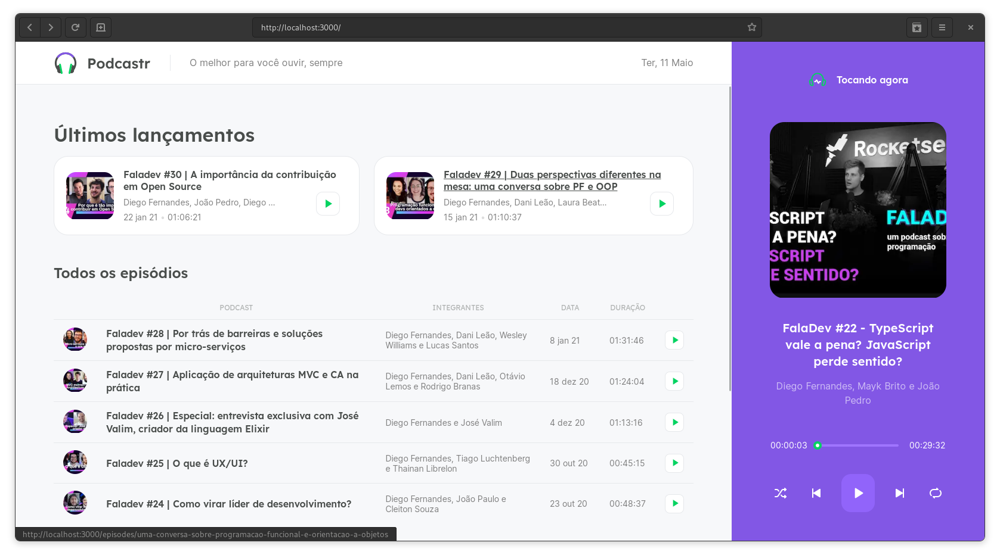

<h1 align="center">
    
</h1>

#### Next Level Week #5

## Sobre o projeto

O **Podcastr** é um site para ouvir podcasts no navegador.

---

## Tecnologias utilizadas

Esse projeto foi desenvolvido utilizando as seguintes tecnologias abaixo:

- Next.js
- TypeScript

Simples assim.

---

## Como contribuir

- Crie um fork deste repositório
- Faça uma branch com a sua feature: `git checkout -b minha-feature`;
- Envie suas alterações: `git commit -m 'feat: Minha nova feature'`;
- Faça um push para a sua branch: `git push origin minha-feature`.